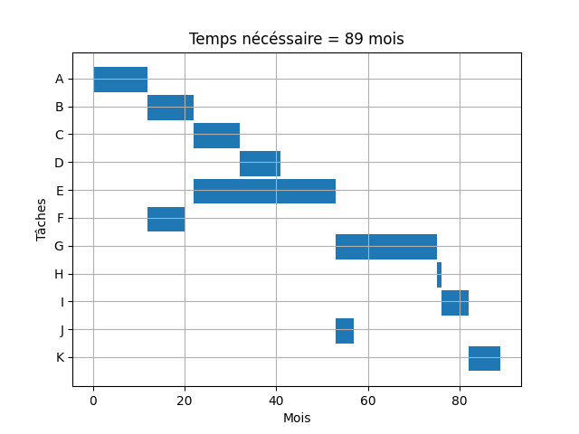

# Solveur graphes de Gantt

Ce script python a pour but de résoudre le graphe de Gantt pour un projet donné. C'est un outil développé pour le management de projet à l'ENSEIRB-MATMECA.
Il permet aussi de déterminer la planification au plus tard de chaque tâche pour une date de fin de projet donnée.

## Utilisation
Commencer par remplir le fichier .csv avec les données du projet.
Il faut pour cela donner pour chaque tâche son **nom**, ses **dépendances**, son **temps d'exécution** (la **description** de la tâche est optionelle)
Séparer les colonnes par un point virgule et la liste des dépendances d'une tâche par des virgules.
Puis lancer :
```
python3 src/gantt_chart_maker.py
``` 
Pour la planification au plus tard, il faut changer la date dans le main du fichier .py (un jour ça sera un argument à passer lors de l'exécution du programme. Si je reviens travailler sur le management. Très peu probable donc).
## Exemple
Le csv suivant (partiel de mars 2017)

|Nom|Dépendances|Temps|(Description)                           |
|---|-----------|-----|----------------------------------------|
|A  |           |12   |Élaboration des plans                   |
|B  |A          |10   |Fouille archéologiques préventives      |
|C  |B          |10   |Terrasements                            |
|D  |C          |9    |Construction des voies d’accès          |
|E  |B          |31   |Construction des ouvrages d’art         |
|F  |A          |8    |Fabrication des équipements ferroviaires|
|G  |D, E, F    |22   |Pose des équipements ferroviaires       |
|H  |G          |1    |Mise sous tension électrique            |
|I  |H          |6    |Essais de roulage                       |
|J  |D, E, F    |4    |Raccordement aux voies existantes       |
|K  |J, I       |7    |Formation des conducteurs SNCF          |

Donne le graphe suivant :



et pour une planification définie en juillet 2017 on a le tableau suivant :

| Tâche | Suivantes  | Durée | Début au plus tard | Fin au plus tard |
|-------|------------|-------|--------------------|------------------|
| K     | []         | 7     | ('jan', 2017)      | ('juil', 2017)   |
| J     | ['K']      | 4     | ('sept', 2016)     | ('dec', 2016)    |
| I     | ['K']      | 6     | ('juil', 2016)     | ('dec', 2016)    |
| H     | ['I']      | 1     | ('juin', 2016)     | ('juin', 2016)   |
| G     | ['H']      | 22    | ('août', 2014)     | ('mai', 2016)    |
| F     | ['G', 'J'] | 8     | ('dec', 2013)      | ('juil', 2014)   |
| E     | ['G', 'J'] | 31    | ('jan', 2012)      | ('juil', 2014)   |
| D     | ['G', 'J'] | 9     | ('nov', 2013)      | ('juil', 2014)   |
| C     | ['D']      | 10    | ('jan', 2013)      | ('oct', 2013)    |
| B     | ['C', 'E'] | 10    | ('mars', 2011)     | ('dec', 2011)    |
| A     | ['B', 'F'] | 12    | ('mars', 2010)     | ('fev', 2011)    |

